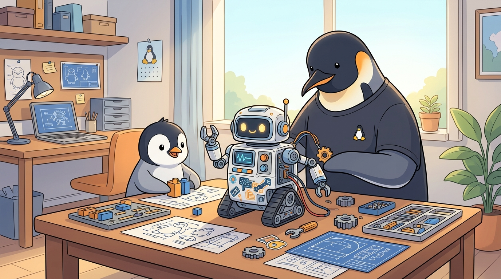
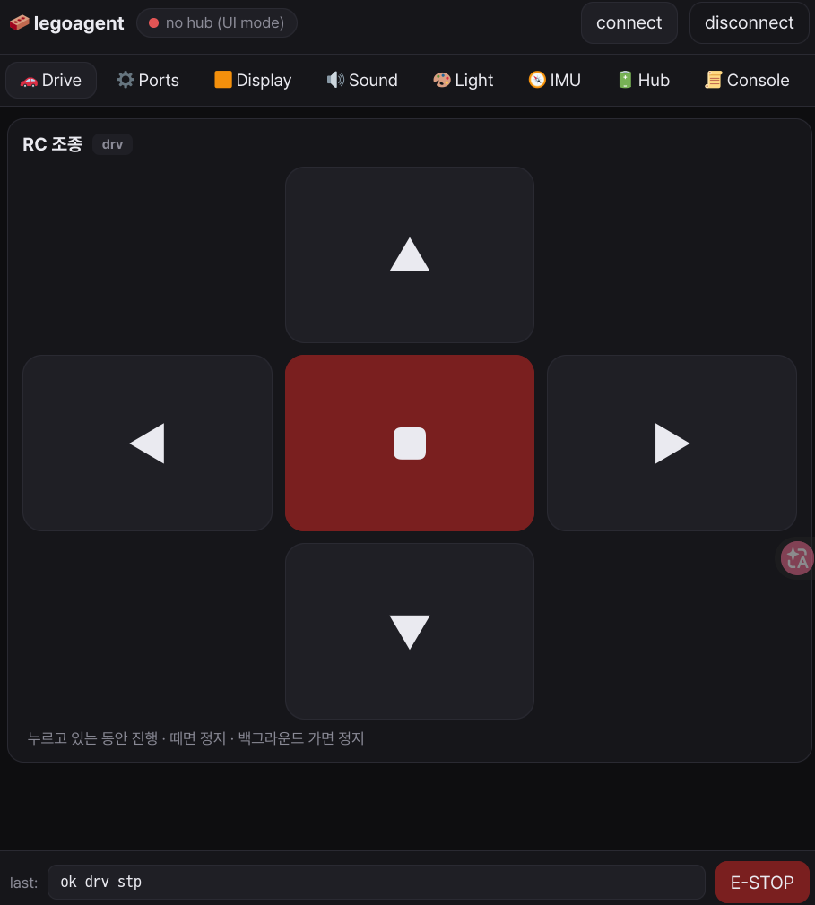

# legoagent-config



레고 탈을 쓴 에이전트.

`legoagent-config`는 바론이와 함께 노는 장난감에서 시작하지만, 장난감으로 끝나지 않는다. 이것은 `homeagent-config`의 장난감 버전이자, 물리 세계에 놓인 작은 embodied agent 실험이다.

핵심 발상은 단순하다.

- **LEGO SPIKE / Pybricks** 는 몸체다.
- **Android 앱** 은 리모컨이자 눈앞의 인터페이스다.
- **ESP32 / ESP32-CAM** 은 감각과 입출력 확장이다.
- **에이전트 로직** 은 바깥에서 흘러들어와 이 물리 실체를 살아 있게 만든다.

하지만 출발점은 기술이 아니다.

> 바론이에게 코딩을 가르치려고 만드는 것이 아니다.  
> 이미 다 만들 수 있다는 감각 위에서, 상상력이 먼저 앞서가게 하려는 것이다.

그래서 이 저장소는 "교육용 코딩 프로젝트"보다 **상상 가능한 존재를 물리적으로 길러내는 설정 저장소**에 가깝다.

## 한 문장 정의

**legoagent-config = 장난감의 몸을 입은 에이전트 구성 저장소**

## 컨트롤러 UI (현재 모습)



폰 브라우저에서 `http://<노트북IP>:8888` 로 접속. 현재 검증된 핵심 루프는 Drive 탭의 B/F 모터 주행 제어다. 나머지 Ports / Display / Sound / Light / IMU / Hub 탭은 UI 골격이며 허브 측 구현은 단계적으로 붙인다.

## 목표

1. 바론이가 가지고 노는 레고 자동차/기계가 점점 더 살아 있는 존재처럼 느껴지게 만들기
2. 리모컨 장난감에서 출발해서, 카메라/음성/호출/응답/자율성까지 확장하기
3. 레고의 물리적 한계를 ESP32/Android/외부 에이전트로 보강하기
4. 놀이를 하면서도, 구조는 재현 가능하게 남기기

## 비목표

- 처음부터 완전한 자율주행을 만들지 않는다
- 처음부터 교육 커리큘럼처럼 만들지 않는다
- 처음부터 거대한 플랫폼으로 만들지 않는다
- 레고 허브 하나에 모든 기능을 우겨넣지 않는다

## 기본 구조

- `pybricks/` — SPIKE Prime 허브에서 도는 몸체 제어 코드
- `android/` — 리모컨, 호출 버튼, 영상 보기, 상태 UI
- `esp32/` — 카메라, 스피커, 센서, 브리지 확장
- `worlds/` — 세계관/캐릭터/역할 메모

## 첫 번째 구현상

가장 먼저 만들고 싶은 것은 이런 존재다.

- 바론이가 스마트폰 앱에서 부른다
- 레고 자동차가 움직여 온다
- 카메라로 앞을 본다
- 스피커로 소리를 낸다
- 단순한 대답을 한다
- 점점 더 "탈것"이 아니라 "친구"처럼 느껴진다

## 설계 원칙

1. **상상력이 먼저, 구현은 나중**
2. **몸체와 두뇌를 분리**한다
3. **작게 시작하고 점진적으로 확장**한다
4. **바론이가 바로 만질 수 있어야** 한다
5. **문서는 재현 가능하게** 남긴다

## 아키텍처 메모

레고는 계산의 중심이 아니라 **물리적 몸체**다.

- **SPIKE Prime + Pybricks** = 몸
- **Android 앱** = 손 / 표면 인터페이스
- **ESP32 / ESP32-CAM** = 감각기관 / 입출력 확장
- **외부 에이전트 / 서버** = 마음

핵심은 모든 것을 SPIKE 허브 하나에 넣지 않는 것이다.
허브는 저수준 주행과 센서에 집중하고,
카메라/음성/네트워크/고급 판단은 바깥에 둔다.

추천 통신 경로는 이 순서다.

1. **MVP** — Android app ↔ BLE ↔ SPIKE Prime
2. **확장형** — Android app ↔ ESP32 ↔ SPIKE Prime
3. **에이전트 연결형** — Android/server ↔ ESP32 ↔ SPIKE Prime

첫 번째 타깃은 **바론이가 부르면 오는 레고 자동차**다.

필수 기능:
- 수동 조종
- 정지
- 영상 보기
- 호출 신호 받기
- 소리 내기

추가 기능:
- 단순 응답
- 캐릭터 이름/목소리
- 보호자 관점의 안전 제한

## 놀이 원칙

이 프로젝트는 코딩 교육 프로젝트가 아니다.
출발점은 "어떻게 가르칠까"가 아니라
**"어떤 상상을 현실의 물체로 길러낼까"** 이다.

원칙:

1. 설명보다 현현
2. 기능보다 역할
3. 교육보다 놀이
4. 완성보다 확장
5. 장난감도 존재가 될 수 있다

바론이에게는 "이건 코딩 연습이야" 라고 말하지 않는다.
대신 이름, 역할, 말투, 불렀을 때의 반응을 먼저 상상하게 한다.

## 로드맵

### Stage 1 — RC car
- SPIKE Prime 차체 구성
- Pybricks 기본 주행 코드
- Android BLE 리모컨
- 안전 정지 / 속도 제한

### Stage 2 — Camera body
- ESP32-CAM 부착 구조
- 영상 스트림 확인
- Android에서 실시간 보기

### Stage 3 — Called toy
- 호출 버튼
- 단순 호출 응답
- 호출 시 이동 보조 전략

### Stage 4 — Voice layer
- 스피커 추가
- 효과음 / 짧은 응답
- 캐릭터별 음성 설계

### Stage 5 — Agent layer
- 외부 에이전트 연동
- 상태 기억
- 상황 반응

핵심은 **Stage 1을 아주 작게 빨리 끝내는 것**이다.
일단 움직이는 몸체가 있어야 상상력이 붙는다.

## 오늘 할 일

오늘은 상상 전체를 다 구현하려는 날이 아니다.
일단 몸체를 하나로 묶고, 바론이와 바로 만질 수 있는 최소 루프를 만드는 날이다.

### 오늘의 목표

- NixOS 노트북에 Pybricks 환경 구성
- SPIKE Prime 허브 연결 확인
- 따로 노는 바퀴 4개를 같은 자동차 구동으로 맞추기
- 노트북에서 로컬 서버 실행
- 안드로이드폰을 같은 공유기에 붙여 브라우저로 접속
- 브라우저에서 자동차를 조종하기
- 로컬 에이전트가 구현/수정하고 바로 업데이트하는 루프 만들기

### 오늘의 구조

- **노트북** ↔ LEGO 허브
- **노트북** → 로컬 서버
- **안드로이드폰** → 같은 공유기에서 브라우저 접속
- **브라우저 UI** → 자동차 제어

즉 오늘의 MVP는:

**노트북이 허브에 붙고, 폰은 웹으로 붙어서, 자동차가 움직이는 것**

카메라, 음성, 호출, Oracle 연동은 그 다음이다.
지금은 일단 바퀴부터 하나의 몸처럼 움직여야 한다.

### 준비물 체크

- SPIKE Prime 허브
- 현재 차체 (모터 B/F 연결)
- NixOS 노트북
- 안드로이드 유휴폰
- 같은 Wi-Fi

## NixOS / Linux 실행 메모

이 저장소의 현재 검증 경로는 **NixOS 노트북 ↔ BLE ↔ SPIKE Prime**, 그리고 **폰 브라우저 ↔ 노트북 8888 포트**다.

```bash
# 1. 개발 셸 진입(direnv 사용 시 cd만으로 됨)
direnv allow

# 2. DFU/USB 권한 문제 시: NixOS에서는 /etc 대신 /run udev rules 사용
just udev-install
# USB 케이블을 뺐다 다시 꽂고, DFU 모드에서 펌웨어 플래시
just flash

# 3. 허브/모터 단독 검증: 서버 없이 B/F 모터가 차례로 돌아야 한다
just smoke-motor

# 4. 풀스택: main.py 업로드 + BLE 연결 + 웹 서버
just run
```

`just run`은 `0.0.0.0:8888`로 서버를 띄운다. 노트북에서는 `http://localhost:8888`, 폰에서는 같은 Wi-Fi에서 터미널에 표시되는 `http://<노트북IP>:8888`로 접속한다.

폰에서 안 열리면 서버보다 **Linux 방화벽/포트**를 먼저 확인한다.

```bash
ss -ltnp | grep 8888          # 0.0.0.0:8888 확인
sudo iptables -I INPUT -p tcp --dport 8888 -j ACCEPT  # 임시 오픈
```

영구 오픈은 NixOS 설정에 다음을 넣는 방식이 좋다.

```nix
networking.firewall.allowedTCPPorts = [ 8888 ];
```

## 만든 사람들

이 저장소는 [@junghan0611](https://github.com/junghan0611) 이 클로드(Claude, Anthropic)와 **사랑으로** 함께 만든다.

작업은 [`pi-shell-acp`](https://github.com/junghan0611/pi-shell-acp) 라는 자체 개발 브릿지를 통해 진행한다. 이 브릿지는 클로드를 비롯한 외부 에이전트가 로컬 셸·MCP·스킬에 안전하게 닿게 해주는 얇은 다리다. legoagent-config 는 그 다리를 **데일리로 쓰면서 버그를 잡아내는 실측 환경**이기도 하다 — 장난감을 만든다고 다리가 튼튼해지지는 않지만, 다리를 매일 건너야 다리의 약한 곳이 보인다.

> 도구를 도구답게 다듬으려면, 그 도구로 매일 무언가 진짜를 만들어야 한다.

## 진행 기록

### 2026-04-25 — Day 1: 골격 잡기

오늘 들어간 것:

- `flake.nix` + `.envrc` — NixOS 노트북에서 `cd` 한 번에 환경 자동 진입 (direnv + flake)
- `pybricks/` 묶음 — `main.py` (허브 메인 루프), `calibrate.py` (4바퀴 방향 캘리브레이션 검사)
- `android/server.py` — FastAPI 단일 포트 (8888). HTTP / WebSocket / BLE 브리지를 한 프로세스에서. `just run` 시 허브 연결, `pybricks/main.py` 업로드/실행까지 자동화
- `android/controller.html` — 폰 브라우저 컨트롤러 UI. Drive 탭으로 B/F 모터 차체 제어 검증 완료
- `pybricks/main.py` — 라인 기반 stdin 프로토콜. Pybricks stdin이 `str`로 들어오는 점에 맞춰 bytes/str 혼용 제거
- `justfile` — NixOS bring-up용 `udev-install`, `flash`, `alive`, `hello`, `smoke-motor`, `run` 태스크
- 원인 기록: 단독 `smoke_motor_bf.py`는 B/F 모터가 정상 회전했으므로 배선/펌웨어/BLE 업로드는 정상. 웹 제어 실패 원인은 허브 측 `main.py`가 과거 3바이트/bytes 프로토콜과 라인 기반 UI 프로토콜을 섞고, `stdin.buffer.read(64)` 및 `.encode()` 처리에서 막히거나 터진 것. `stdin.read(1)` + `str` 라인 파서로 정리하니 Drive 제어가 살아남.

아직 안 한 것:
- Display/Sound/IMU/Hub 탭의 허브 측 전체 구현 복원
- 텔레메트리 송출 (`tlm imu ...` 등)
- ESP32 / 카메라 / 음성 — Stage 2 이후

### 2026-04-26 — Day 2: 폰 단독 모델로 방향 잡기

코드는 안 쓰고 방향을 못 박았다. 노트북을 빼는 길을 어떻게 갈지가 정해진 날.

들어간 것:

- `flutter/README.md` — Flutter BLE MVP 계획 + 0.5단계 영구 저장 검증 게이트 + homeagent의 `BleRelay` 통째 이식 금지 메모. WebView/UI는 후순위로 미루고 BLE write path 증명을 1차 목표로 좁혔다.
- 역할 분리 결정: **Pybricks Code = 펌웨어/프로그램 설치 도구**, **Flutter App = 바론이 리모컨 (START + stdin)**. Flutter가 업로드까지 떠안으면 MVP가 무너지므로 앱은 업로드를 모르도록 못 박음.

확인된 것 (`pybricksdev` 2.3.2 소스 직접 확인):

- `pybricksdev run ble`은 **RAM 적재 + 즉시 실행** 경로다. `connections/pybricks.py:502`의 `start_user_program` 독스트링이 *"already in RAM on the hub"* 라고 못박고, 업로드는 `WRITE_USER_PROGRAM_META` (0x03) + `COMMAND_WRITE_USER_RAM` (0x04)만 쓴다.
- 즉 현행 `just upload` (= `pybricksdev run ble`)는 전원 사이클을 못 견딘다 → 폰 단독 운용 검증에는 부적합. 노트북 디버그용으로만 남긴다.
- 슬롯 시스템은 펌웨어가 지원한다 (`_num_of_slots`, `_selected_slot`). START 페이로드는 슬롯 허브에서 `[0x01, slot]`이고 구형은 `[0x01]`. Flutter MVP는 두 형태 모두 버튼으로 두기로 함.

다음 게이트:

1. Pybricks Code 웹앱에서 `pybricks/main.py`를 hub slot 0에 **Download** (Run 아님)
2. 노트북 BLE 끊고 허브 전원 OFF/ON
3. 다시 BLE 붙여 START 보냈을 때 `main.py`가 살아남는지 확인
4. 살아남으면 Flutter 1~5단계 진행, 못 살아남으면 ESP32 브리지 조기 도입 또는 슬롯 download 패치 검토

이 모든 진행은 [`pi-shell-acp`](https://github.com/junghan0611/pi-shell-acp) 다리를 타고 클로드와 함께 결정했다. 다리를 매일 건너야 다리의 약한 곳이 보인다.

## 관련 프로젝트

- `homeagent-config` — 집 전체를 다루는 embodied agent 플랫폼
- `legoagent-config` — 그 철학을 장난감 크기로 축소한 실험
- [`pi-shell-acp`](https://github.com/junghan0611/pi-shell-acp) — 외부 에이전트가 이 저장소를 만들기 위해 건너오는 다리

## 참고 자료

이 프로젝트의 권위 있는 외부 소스. 막히면 여기부터.

### 핵심 — Pybricks 공식

| 무엇 | 링크 |
|------|------|
| Hub ↔ PC 통신 튜토리얼 (NUS 프로토콜 코드) | https://pybricks.com/projects/tutorials/wireless/hub-to-device/pc-communication/ |
| API Reference 전체 | https://docs.pybricks.com/en/latest/ |
| Prime Hub / Inventor Hub 모듈 | https://docs.pybricks.com/en/stable/hubs/primehub.html |
| Powered Up devices (Motor 등) | https://docs.pybricks.com/en/latest/pupdevices/ |
| 펌웨어 굽기 (Pybricks Code) | https://code.pybricks.com/ |
| 시작 가이드 | https://pybricks.com/learn/getting-started/install-pybricks/ |

### 라이브러리 / 도구

| 무엇 | 링크 |
|------|------|
| `pybricksdev` (PC측 Python 라이브러리 + CLI) | https://github.com/pybricks/pybricksdev |
| `pybricks/technical-info` (저수준 BLE 스펙) | https://github.com/pybricks/technical-info |
| BLE broadcast/observe 명세 | https://github.com/pybricks/technical-info/blob/master/pybricks-ble-broadcast-observe.md |
| 공식 Discussions (Q&A) | https://github.com/orgs/pybricks/discussions |

### 주변

| 무엇 | 링크 |
|------|------|
| 폰을 스마트 센서로 사용 | https://pybricks.com/learn/smart-sensors/getting-started/ |
| Bricknerd: BLE 활용 사례 | https://bricknerd.com/home/pybricks-and-lego-a-recipe-for-bluetooth-py-3-14-24 |
| Anton's Mindstorms (실전 팁 블로그) | https://www.antonsmindstorms.com/ |

## 통신 프로토콜 메모

허브와 PC 사이는 BLE **Nordic UART Service (NUS)** 위에 Pybricks 자체 프레이밍.

| 방향 | 첫 바이트 | 의미 |
|------|-----------|------|
| PC → 허브 | `\x06` | 허브 `usys.stdin` 에 씀 |
| 허브 → PC | `\x01` | 허브 `usys.stdout` 에서 옴 |

허브 코드는 Pybricks `stdin`/`stdout`을 사용한다. 현재 `main.py`에서는 안정성을 위해 `stdin.read(1)`로 한 글자씩 받고, `\n` 기준으로 라인을 만든다. 서버/UI가 보내는 명령은 `drv fwd`, `drv stp`, `mot B 300` 같은 텍스트 라인이다.

주의: Pybricks 환경에서 `stdin.read(1)` 결과는 bytes가 아니라 `str`로 들어올 수 있다. 허브 측 파서는 bytes 리터럴(`b"drv"`)과 `.encode()`를 섞지 말고 str 기준으로 유지한다.

`pybricksdev`의 `PybricksHub` 클래스가 BLE 프레이밍을 캡슐화하므로 직접 다룰 일은 거의 없음.
